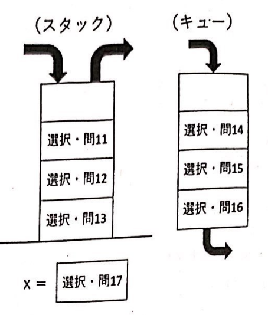
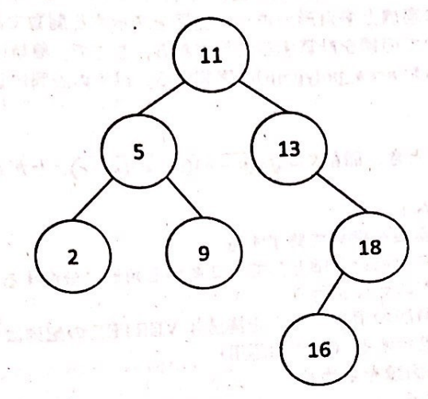
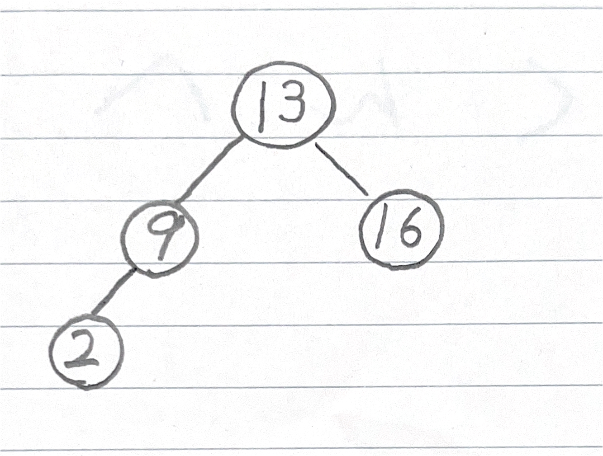

# 2019年2月20日 データ構造とアルゴリズム 期末試験 問題・解答

問題内の誤字・脱字と思われる箇所を修正しています。

## 1. 探索

```c

~ A ~
{
    int left = 0, right = n-1, mid;
    
    while( left <= right ){
        mid = (left+right)/2;
        if( data[mid] == key ){
            ~ B ~
        } else if ( data[mid] < key ){
            ~ C ~
        } else {
            ~ D ~
        }
    }
    return -1;
}

int main(void)
{
    double data[10] = { 0.2, 1.5, 3.1, 5.4, 7.0, 9.8, 12.3, 15.4, 19.0, 24.6};
    double x;
    int found;

    scanf("%f", &x); //%lfにすべき
    found = search(x, data, 10);
    if( found >= 0){
        printf("Found %f at data[%d]\n", x, found); //%lfにすべき
    } else {
        printf("Not found %d\n", x); //%lfにすべき
    }

    return 0;
}

```

### (1) 空欄Aに入る関数searchの定義として適切なものを選択せよ。

1. `int search(int key, int data[], int n)`
2. `int search(double key, int data[], int n)`
3. `int search(int key, double data[], int n)`
4. `int search(double key, double data[], int n)`
5. `double search(double key, double data[], int n)`
6. `double search(double key, double data[], double n)`


<details><summary>解答</summary>

**4 - `int search(double key, double data[], int n)`**

> 解説  
> main関数を見ると`found = search(x, data, 10);`の行でsearch関数が使われています。  
> ここから逆算して考えると、  
>  - foundはint型で定義されている→search関数の返り値はint型である
>  - xはdouble型→search関数の第一引数（key）はdouble型
>  - main関数内のdataはdouble型→search関数の第二引数（data）はdouble型
>  - `10`はint型→search関数の第三引数（n）はint型
> 
> ちなみに、C言語内で数字や文字をそのまま書く（リテラル）は以下のような扱いになります。
> `10`→int型  
> `10.0`→double型（floatよりdoubleが優先されます）  
> `'1'`→char型（文字）  
> `"1"`→char*型（文字列）

</details>

### (2) 空欄B,C,Dに入るプログラムとして適切なものを選択せよ。

1. `left = mid;`
2. `left = mid - 1;`
3. `left = mid + 1;`
4. `right = mid;`
5. `right = mid - 1;`
6. `right = mid + 1;`
7. `left = right;`
8. `return left;`
9. `return right;`
10. `return mid;`（10番→0番）

<details><summary>解答</summary>

**B-0 `return mid;`**  
**C-3 `left = mid + 1;`**  
**D-5 `right = mid - 1;`**

> 解説  
> 二分探索法です。

</details>

### (3)

以下の文章中の空欄に入る語句を選択せよ。（同じ選択肢を複数回使用しても構わない。）
二分探索は、探索を行う対象の配列がソートされていることを利用することで、線形探索よりも効率的に探索を行うアルゴリズムである。
線形探索では探索範囲内の全てのデータを一つずつ繰り返し比較していく必要があるのに対して、二分探索では一回の繰り返し処理毎に探索範囲の大きさを `間 5`に絞り込むことで、効率的に探索を実現できる。
線形探索の計算量が`問6`であるのに対して、二分探索の計算量は`問7`となる。

1. 2倍
2. 1/2倍
3. 1/3倍
4. 1/4倍
5. 1/10倍
6. O(n^2)
7. O(n log(n))
8. O(n)
9. O(log(n))
10. O(1)

<details><summary>解答</summary>

5. 1/2倍
6. O(n)
7. O(log(n))

</details>

### (4)

プログラム中のこの処理が実行される回数は、入力されるキーの値によって異なるが、配列の大きさが 10の場合、最小で`間8`回、最大で`間9`となる。
なお、配列中に存在しない値がキーとして入力された場合は、常に`間10`回となる。

1. 0
2. 1
3. 2
4. 3
5. 4
6. 5
7. 8
8. 10
9. 12
10. 無限

<details><summary>解答</summary>

8. 1
9. 4
10. 4

</details>

## 2. ソート

```c

#include <stdio.h>
#define N 5

/* a */

int comp_SDATA(struct SDATA s1, struct SDATA s2)
{
    /* b */
}

void isort(struct SDATA S[], int n)
{
    int i, j, r;
    struct SDATA ins;

    for (i = 1; i < n; i++)
    {
        ins = S[i];
        r = comp_SDATA(/* c */);
        if (r < 0)
        {
            j = i;
            while (/* d */)
            {
                S[j] = S[j - 1];
                j--;
                r = comp_SDATA(/* e */);
            }
            S[j] = ins;
        }
    }
}

int main(void)
{
    int i;

    struct SDATA D[N] = {
        {1001, 90, 85, 70},
        {1002, 65, 80, 70},
        {1003, 80, 85, 75},
        {1004, 100, 70, 80},
        {1005, 80, 90, 65}};

    isort(D, N);
    for (i = 0; i < N; i++)
    {
        printf("ID:%d Total:%d\n", D[i].id, D[i].eng + D[i].math + D[i].prog);
    }
    return 0;
}
```

以下のプログラムは、 入力データを成績の合計点の降順に並べ換えるプログラムである。  
入力データは以下の4つのメンバを持つ構造体 SDATA の配列に格納される。  
1. 整数型の学生番号を保存するメンバ id
2. 整数型の英語の成績を保存するメンバ eng
3. 整数型の数学の成績を保存するメンバ math
4. 整数型のプログラミングの成績を保存するメンバ prog

プログラムの空欄 (a)~(e)は、以下のような内容とする。  
(a) 構造体 SDATA の定義  
(b) 関数 comp_SDATA は、 引数として与えられる構造体 SDATA の変数 s1とs2に含まれる3つの成績の合計の大小を比較する関数である。  
s1とs2の3つの成績(英語、数学、プログラミング)の合計をそれぞれsum1, sum2とするとき、 返り値は以下のようになる。  

    sum1<sum2ならば、 返り値は-1
    sum1=sum2ならば、 返り値は 0
    sum1>sum2ならば、 帰り値は 1

(c), (d), (e) 関数 isort は、 挿入ソートのアルゴリズムを使って、引数の構造体 SDATAの配列のデータを3つの成績の合計の降順に並べ換える関数である。  

### (1) 空欄 (a) を埋めよ。

<details><summary>解答</summary>

```c
struct SDATA
{
    int id;
    int eng;
    int math;
    int prog;
};
```

> (a) 問題文の通りに構造体を宣言します。  

</details>

### (2) 空欄 (b) を埋めよ。

<details><summary>解答</summary>

```c
    int sum1, sum2;
    sum1 = s1.eng + s1.math + s1.prog;
    sum2 = s2.eng + s2.math + s2.prog;
    if (sum1 < sum2)
    {
        return -1;
    }
    else if (sum1 == sum2)
    {
        return 0;
    }
    else
    {
        return 1;
    }
```

> (b) 問題文の通りに関数を定義します、if文は条件式なので`==`を使うことを忘れないでください。  

</details>

(3) 空欄 (c)~(e) を埋めよ。

<details><summary>解答</summary>

```c
(c) S[i - 1], ins
(d) j > 0 && r < 0
(e) S[j], ins
```

> (c)~(e) 挿入ソートを実装します。moodleであれば試行しながら行えますが、手書きだと厳しいです。しっかりトレースをして確認してください。

</details>

## 3. スタック・キュー

### (1)

空のスタックと空のキューがそれぞれ1つずつある。下記の操作を順に実行した場合、変数xに代入されるデータはどれか。また、最終的なスタックとキューの状態は、どのようになっているか。下記の選択肢から選べ。ただし、スタックは下から格納し、キューは、次に取り出されるデータが一番下にあるものとする。



操作
```
push(a)
push(b)
enqueue(pop())
push(c)
enqueue(d)
enqueue(e)
enqueue(dequeue())
push(dequeue())
enqueue(f)
x = pop()
```

選択肢  
1. a
2. b
3. c
4. d
5. e
6. f
7. 空（何も入っていない）

<details><summary>解答</summary>

解答  
11. 7-空（何も入っていない）  
12. 3-c  
13. 1-a  
14. 6-f  
15. 2-b  
16. 5-e  
17. 4-d  


> 覚えておくべきこと
> - スタック → 積んでいく方式 - 一番上のもの（最後に入れたもの）が取り出される  
> - キュー → 並んでいく方式 - 一番下のもの（最初に入れたもの）が取り出される
> 
> 覚え方として、スタックは積ん読・机の上、キューはレジの並び・ところてんなどがあります。
> 
> 頭の中で考えたりせずに、素直に紙に書きながらトレースするのが鉄則です。  
> push(a),push(b)なので、スタックが上からb->aとなります。  
> enqueue(pop())スタックからbを出しキューに入れ、キューがb   
> push(c) スタックがc->a  
> enqueue(d) キューがd->b  
> enqueue(e) キューがe->d->b  
> enqueue(dequeue()) キューからbを出しキューに入れ、キューがb->e->d  
> push(dequeue()) キューからdを出しスタックに入れ、スタックがd->c->a
> enqueue(f) キューがf->b->e
> x=pop() スタックからdが出てくる
>
> 確認方法としては
> 1. 二度やる
> 2. 選択肢をすべて使っているか（今回は、解答欄と選択肢が同じ数なのですべて使う可能性が高い）
> 3. 選択肢が被っていないか（今回は、push()もenqueue()も文字に被りがないため選択肢が被るわけがない）
>
> 
> キューを右から左で覚えている人は置き換えて考えてもいい。そちらのほうがスタックと勘違いしにくい。

</details>

### (2)

現在、キュー1のように、aからdまでのデータが順に入っている。これを、キュー2のように要素の順番を並び替えたい。このとき、利用できるリソース（資源）は、スタック1つと一時変数1個とする。
push/pop/enqueue/dequeueの操作により実現する場合、pushとenqueueは、それぞれ少なくとも何回実行することになるか。pushの回数とenqueueの回数を答えよ。ただし、スタックは下から格納し、キューは、次に取り出されるデータが一番下にあるものとする。

<details><summary>解答</summary>

**push 3回 ※一時変数をスタックではないものと考える場合は2回**

※ 図的にはスタックを一つだけ格納できるスタックとして扱っているが、`一時"変数"`と考えると、変数はスタックではないのでpush動作は必要ない。よって、一時変数をスタックと考えるとpush3回。一時変数を変数として考えるとpush2回となる。

**enqueue 3回**

> 一時変数は1つだけ格納できるスタックと考えるものとする。
>
> キュー1がd->c->b->aとなっており、キュー2のようにa->b->c->dとしたい。
>
> キュー2を見ると`c,b,aの順にenqueueしなければならない`ということがわかる。
>
> まず、キュー1からdequeueしてaを出す、aは最後に取り出すのでスタックにpushする。
>
> 次に、キュー1からdequeueしてbを出す、**bはcの次に入れなければならないため**一時変数にpushする。（bをスタックに入れ、cを一時変数でもよい）
>
> 最後に、キュー1からdequeueしてcを出す、一時変数はもう入らないのでスタックにpushする。
>
> そして、c,b,aの順にpopしてenqueueすればd->c->b->aとなる。
>
> pushを3回とenqueueを3回したため、これが答えである。
>
> 確認のため、2回でできるかどうかを考えるとキュー2にてdが一番下にあることから最低3回はdequeueしなければならないため、pushも3回しなければならなくなり、enqueueも3回しなければならなくなるため理論的にも正しいことがわかった。

</details>

## 4.二分木

次の二分探索木について、以下の設問に答えなさい。なお、**この二分探索木は重複しない整数を格納する。**



### (1)
図の二分探索木について、**9の右側の子ノード**に整数を格納することを考える。次の選択肢から、格納できる整数を全て答えなさい。該当する選択肢が複数ある場合はすべて選ぶこと。

1. 1
2. 3
3. 4
4. 6
5. 7
6. 8
7. 10
8. 11
9. 12
10. 14

<details><summary>解答</summary>

 - (7) - 10

> `9 < x < 11`を満たせば良いので、10を選べば良い。

</details>

### (2)

図の二分探索木について、以下の順にノードを削除したとする。

 - 18
 - 11
 - 5

全てのノードを削除した後の二分探索木を描きなさい。なお、子ノードを2つ持つノードを削除する際は、右側の子ノードの最小値を削除するノードの位置に移動する操作を行う。

<details><summary>解答</summary>



> 問題文の`子ノードを2つ持つノードを削除する際は、右側の子ノードの最小値を削除するノードの位置に移動する`が重要である。
>
> 18を削除すると16が繰り上がる。
>
> 11を削除すると右側の子ノードの最小値である13が繰り上がり、16も付随する。
>
> 5を削除すると右側の子ノードの最小値である9が繰り上がる。
> 

</details>

### (3)

図の二分木（設問2の削除を行う前の二分木）について、ルートノードから帰りがけ順（Post Order）で走査した場合の出力を答えなさい。帰りがけ順では、以下のようなプログラムで出力を行う。

```c
void post_order(struct TREE *p)
{
    if(p != NULL){
        post_order(p->left);
        post_prder(p->right);
        printf("%d ", p->data);
    }
}
```

<details><summary>解答</summary>

```
2 9 5 16 18 13 11
```

> 二分木を出力する手法を暗記しておいたほうが無難。
>
> 覚えていなければプログラムを見てトレースすれば良い。
>
> 基礎的な再帰関数なので、落ち着いて解けば大丈夫。

</details>

## 5. 応用問題

多負形の面積を求めるプログラムについて考える。まず、頂点の座標(x,y)を表す機造体VERTEX を定義する。

それで、構造体 VERTEX の配列に多角形の頂点の座標を順に入力して表現することとする。print_vertex()とprint_vertexes()はそれぞれ点の座標と多角形の頂点の座標を表示する関数である。

area_triangle()は、3点の頂点の座標からヘロンの公式を用いて面積を計算する関数である。

ここで、備単のため多角形は凸多角形の場合のみを対象とし、以下のアルゴリズムを area_polygon()に実装する。以下の設問に答えよ。

ヘロンの公式
```
三角形の各辺の長さが a,b,cのとき、面積S=sqrt(s(s-a)(s-b)(s-c))
ただし、s=(a+b+c)/2
sqrt()は二乗根を返す関数である。
```

n角形の面積を求めるアルゴリズム
```
1. nが3のときは、三角形の面積を求めて終了する
2. nが4以上のときは、最初の頂点を基準としてn-2個の三角形に分割する
3. 分割した三角形について以下の処理を行う
（ア) 面積を求めるため、三角形の頂点データを構造体 VERTEXの配列にコピーする
(イ) 三角形の頂点データを表示する（動作確認用）
(ウ) (ア)で作成した三角形の面積を求める
4. 全ての三角形の面積を合計する
```

### (1)

空欄(a)を埋めて関数area_triangle()を完成させなさい。

```c

```
